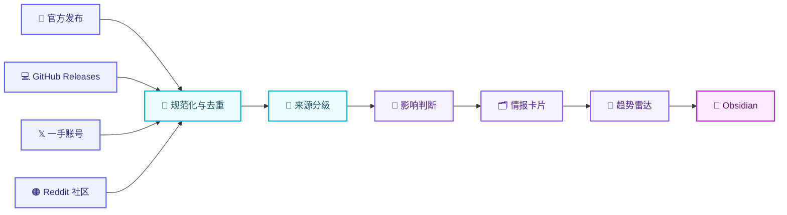

<p align="center">
  <strong>简体中文</strong> · <a href="README_EN.md">English</a>
</p>

<p align="center">
  
</p>

<h1 align="center">🛰️ AI Intelligence Radar</h1>

<p align="center">
  <strong>把一手 AI 动态变成可追溯的判断，再沉淀为自己的长期知识库。</strong>
</p>

<p align="center">
  <a href="https://github.com/jj1292/ai-intelligence-radar/actions/workflows/test.yml"></a>
  
  
  
</p>

<p align="center">
  
  
  
  
  
  
</p>

<p align="center">
  <a href="#-为什么做这个项目">为什么</a> ·
  <a href="#-系统如何工作">工作流</a> ·
  <a href="#-30-秒体验">快速开始</a> ·
  <a href="#-知识库输出">知识库</a> ·
  <a href="#%EF%B8%8F-roadmap">Roadmap</a>
</p>

---

## ✨ 为什么做这个项目

每天的信息很多，但真正能改变认知的信号很少。这个项目不追求“抓得最多”，而是建立一条从信息到判断的可靠链路。

| 🛰️ 一手信号 | 🧠 认知卡片 | 📈 趋势雷达 |
| --- | --- | --- |
| 跟踪官方发布、官方仓库、X 一手账号和 Reddit 社区 | 每条内容回答“发生了什么、为什么重要、证据是什么” | 只有多个独立信号连续出现，才升级为趋势候选 |

> [!TIP]
> **目标不是替你读完互联网，而是每天留下少量、可复核、以后还能用的知识。**

## 🌈 当前能力

<table>
  <tr>
    <td width="50%" valign="top">
      <h3>🔭 Source Radar</h3>
      <p>统一管理 Codex、Claude、Gemini、X、Reddit 等来源，并记录采集方式与授权状态。</p>
    </td>
    <td width="50%" valign="top">
      <h3>🧭 Source Tiers</h3>
      <p>T1 官方事实、T2 一手账号、T3 社区信号分级，防止把热度误写成结论。</p>
    </td>
  </tr>
  <tr>
    <td width="50%" valign="top">
      <h3>🗂️ Knowledge Cards</h3>
      <p>自动输出 Obsidian Markdown，保留时间、公司、主题、短证据和影响判断。</p>
    </td>
    <td width="50%" valign="top">
      <h3>📡 Trend Detection</h3>
      <p>至少两条独立信号才进入趋势候选，并持续观察跨公司、跨来源的变化。</p>
    </td>
  </tr>
</table>

## 🧩 来源矩阵

| 等级 | 来源 | 角色 | 当前状态 |
| :---: | --- | --- | :---: |
| 🟣 **T1** | 官方 Release Notes、Newsroom、官方 GitHub | 事实底座 |  |
| 🔵 **T2** | 官方与核心团队 X 账号 | 一手补充、扩散信号 |  |
| 🟠 **T3** | Reddit AI 社区 | 问题、用例、情绪和弱信号 |  |

已注册 **10 个来源入口**：8 个可直接监控，X 和 Reddit 2 个等待合规授权。详见 [`config/sources.json`](config/sources.json)。

## 🔄 系统如何工作



<details>
<summary><strong>查看 Dify 节点设计</strong></summary>

```text
定时触发 → 来源路由 → 多平台采集 → 规范化 → 事件去重
         → LLM 重要性判断 → 证据门 → 知识导出 → 每日简报
```

完整设计见 [`docs/dify-workflow.md`](docs/dify-workflow.md)。

</details>

## ⚡ 30 秒体验

### 1. 验证来源注册表

```bash
python3 source_registry.py --config config/sources.json
```

预期输出：

```text
sources=10 ready=8 requires_auth=2 tier1=8 tier2=1 tier3=1
```

### 2. 生成知识卡片和趋势雷达

```bash
python3 build_knowledge_base.py \
  --input examples/intelligence_signals.json \
  --output /tmp/ai-intelligence-radar \
  --date 2026-07-22
```

### 3. 运行测试

```bash
python3 -m unittest discover -s tests -v
```


## 💜 知识库输出

```text
ai-intelligence-radar/
├── signals/
│   └── 2026-07-22/
│       ├── openai-xxxxxxxxxx.md
│       ├── anthropic-xxxxxxxxxx.md
│       └── community-xxxxxxxxxx.md
└── trends/
    └── 2026-07-22-trend-radar.md
```

每张卡片固定包含：

- 🔗 原始来源与发布时间
- 🏢 公司、平台和来源等级
- 📝 一句话结论
- 💡 为什么重要
- 🔎 可回到原文核验的短证据
- 🎯 影响评分、可信度与判断边界

规范定义见 [`schemas/intelligence-signal.schema.json`](schemas/intelligence-signal.schema.json)。

## 🔐 平台与数据边界

> [!IMPORTANT]
> - X Recent Search 需要开发者项目和 `X_BEARER_TOKEN`。
> - Reddit 使用 OAuth，并遵守平台的数据使用与留存要求。
> - API Key、Token 和 OAuth 凭证只能进入本地环境变量或 GitHub Secret。
> - 知识库保存链接、必要元数据、短证据和衍生判断，不批量复制完整平台内容。
> - T3 社区热度必须经过 T1 官方来源或复现实验交叉验证。

## 🗺️ Roadmap

| 版本 | 主题 | 状态 |
| :---: | --- | :---: |
| `v0.1` | 可运行简报、输入契约、测试与 CI | ✅ Done |
| `v0.2` | 来源注册表、情报 Schema、Obsidian 卡片、趋势雷达 | ✅ Done |
| `v0.3` | 官方采集器、X API、Reddit OAuth、48 小时时效、事件去重 | 🚧 Next |
| `v0.4` | 导入 Dify DSL、定时运行、证据校验、自动写入 | 🧭 Planned |
| `v1.0` | 周/月复盘、来源质量评分、主题订阅、评测指标 | 🌟 Vision |

## 📚 文档

- 📘 [`v0.2 PRD`](docs/PRD-AI-Intelligence-Radar-v0.2.md)
- 🔄 [`Dify 工作流蓝图`](docs/dify-workflow.md)
- 🧩 [`情报信号 Schema`](schemas/intelligence-signal.schema.json)
- 📡 [`来源注册表`](config/sources.json)
- 📝 [`Changelog`](CHANGELOG.md)

---

<p align="center">
  <strong>如果这个项目也能帮你减少信息焦虑、建立自己的 AI 判断，欢迎点一个 ⭐ Star。</strong>
</p>

<p align="center">
  Built with <strong>Dify</strong> · <strong>Python</strong> · <strong>Obsidian</strong>
</p>

<p align="center">
  <a href="LICENSE"></a>
</p>
