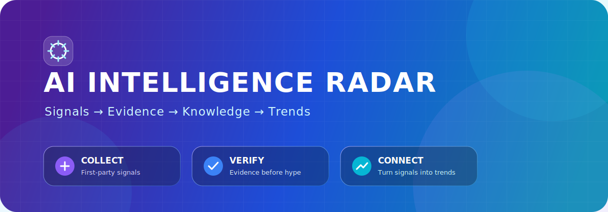
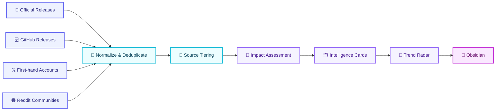

<p align="center">
  <a href="README.md">简体中文</a> · <strong>English</strong>
</p>

<p align="center">
  
</p>

<h1 align="center">🛰️ AI Intelligence Radar</h1>

<p align="center">
  <strong>Turn first-hand AI updates into traceable insights and a knowledge base that compounds over time.</strong>
</p>

<p align="center">
  <a href="https://github.com/jj1292/ai-intelligence-radar/actions/workflows/test.yml"></a>
  
  
  
</p>

<p align="center">
  
  
  
  
  
  
</p>

<p align="center">
  <a href="#-why-this-project">Why</a> ·
  <a href="#-how-it-works">Workflow</a> ·
  <a href="#-30-second-quick-start">Quick Start</a> ·
  <a href="#-knowledge-base-output">Knowledge Base</a> ·
  <a href="#%EF%B8%8F-roadmap">Roadmap</a>
</p>

---

## ✨ Why This Project

There is no shortage of daily information, but only a small number of signals can genuinely improve how we understand the AI industry. This project is not about collecting the most content. It builds a reliable path from information to judgment.

| 🛰️ First-hand Signals | 🧠 Insight Cards | 📈 Trend Radar |
| --- | --- | --- |
| Track official announcements, repositories, first-hand X accounts, and Reddit communities | Every item answers what happened, why it matters, and what evidence supports it | A signal becomes a trend candidate only after it appears repeatedly across independent sources |

> [!TIP]
> **The goal is not to read the entire internet for you. It is to preserve a small set of verifiable insights that remain useful over time.**

> [!NOTE]
> **Starting with v0.3, the project is evaluation-first: fixed cases expose what works and what fails before an Agent Loop is added.**

## 🌈 Current Capabilities

<table>
  <tr>
    <td width="50%" valign="top">
      <h3>🔭 Source Radar</h3>
      <p>Manage Codex, Claude, Gemini, X, Reddit, and other sources in one registry, including collection methods and authorization status.</p>
    </td>
    <td width="50%" valign="top">
      <h3>🧭 Source Tiers</h3>
      <p>Separate T1 official facts, T2 first-hand accounts, and T3 community signals so popularity is not mistaken for evidence.</p>
    </td>
  </tr>
  <tr>
    <td width="50%" valign="top">
      <h3>🗂️ Knowledge Cards</h3>
      <p>Generate Obsidian Markdown with timestamps, companies, topics, short evidence, and an assessment of potential impact.</p>
    </td>
    <td width="50%" valign="top">
      <h3>📡 Trend Detection</h3>
      <p>Require at least two independent signals before creating a trend candidate, then track changes across companies and sources.</p>
    </td>
  </tr>
</table>

## 🧩 Source Matrix

| Tier | Sources | Role | Status |
| :---: | --- | --- | :---: |
| 🟣 **T1** | Official release notes, newsrooms, and GitHub repositories | Factual foundation |  |
| 🔵 **T2** | Official and core-team X accounts | First-hand context and distribution signals |  |
| 🟠 **T3** | Reddit AI communities | Problems, use cases, sentiment, and weak signals |  |

The registry contains **10 source entry points**: 8 can be monitored directly, while X and Reddit await compliant authorization. See [`config/sources.json`](config/sources.json) for details.

## 🔄 How It Works



<details>
<summary><strong>View the Dify node design</strong></summary>

```text
Scheduled trigger → Source routing → Multi-platform collection → Normalization → Event deduplication
                  → LLM importance assessment → Evidence gate → Knowledge export → Daily briefing
```

See [`docs/dify-workflow.md`](docs/dify-workflow.md) for the complete design.

</details>

## ⚡ 30-Second Quick Start

### 1. Validate the source registry

```bash
python3 source_registry.py --config config/sources.json
```

Expected output:

```text
sources=10 ready=8 requires_auth=2 tier1=8 tier2=1 tier3=1
```

### 2. Generate knowledge cards and the trend radar

```bash
python3 build_knowledge_base.py \
  --input examples/intelligence_signals.json \
  --output /tmp/ai-intelligence-radar \
  --date 2026-07-22
```

### 3. Run the tests

```bash
python3 -m unittest discover -s tests -v
```


### 4. Run the product evaluation

```bash
python3 evaluate_radar.py \
  --cases evals/cases.jsonl \
  --output evals/baseline-report.md
```

Current baseline: **3 cases, 2 passed, 1 failed, average score 1.89/2**. The known gap is that signals older than the 48-hour window are not filtered yet. See [`evals/baseline-report.md`](evals/baseline-report.md).

## 🧪 Evaluation First

An AI product cannot be judged by whether one output merely looks plausible. This project repeatedly evaluates the same real tasks across six dimensions:

| Dimension | Core question |
| --- | --- |
| 🎯 Relevance | Are expected trends surfaced while noise is blocked? |
| 🔗 Evidence | Are time, short evidence, and original sources preserved? |
| 🧭 Coverage | Are the task's required signals complete? |
| ⏱️ Deduplication & freshness | Are duplicates and stale items excluded? |
| 💡 Judgment value | Does the output explain why it matters and state its limits? |
| ⚙️ Process reliability | Do cards, trend reports, and run state agree? |

Each dimension uses a `0 / 1 / 2` scale. Source-tier confusion, missing source links, fabricated evidence, credential leaks, and unauthorized external actions are veto conditions. See [`evals/rubric.md`](evals/rubric.md) for the complete contract.

## 💜 Knowledge Base Output

```text
ai-intelligence-radar/
├── signals/
│   └── 2026-07-22/
│       ├── openai-xxxxxxxxxx.md
│       ├── anthropic-xxxxxxxxxx.md
│       └── community-xxxxxxxxxx.md
└── trends/
    └── 2026-07-22-trend-radar.md
```

Each card consistently includes:

- 🔗 Original source and publication time
- 🏢 Company, platform, and source tier
- 📝 One-sentence conclusion
- 💡 Why it matters
- 🔎 Short evidence that can be verified against the original source
- 🎯 Impact score, confidence level, and judgment boundaries

The specification is defined in [`schemas/intelligence-signal.schema.json`](schemas/intelligence-signal.schema.json).

## 🔐 Platform and Data Boundaries

> [!IMPORTANT]
> - X Recent Search requires a developer project and `X_BEARER_TOKEN`.
> - Reddit uses OAuth and must comply with the platform's data-use and retention requirements.
> - API keys, tokens, and OAuth credentials must stay in local environment variables or GitHub Secrets.
> - The knowledge base stores links, necessary metadata, short evidence, and derived analysis rather than bulk copies of full platform content.
> - T3 community interest must be cross-checked against a T1 official source or a reproducible experiment.

## 🗺️ Roadmap

| Version | Theme | Status |
| :---: | --- | :---: |
| `v0.1` | Runnable briefing, input contract, tests, and CI | ✅ Done |
| `v0.2` | Source registry, intelligence schema, Obsidian cards, and trend radar | ✅ Done |
| `v0.3` | Eval Contract, 3 baseline cases, scorer, and reproducible report | 🚧 Current |
| `v0.4` | Fix the 48-hour freshness gap and add a controlled minimal Agent Loop | 🧭 Next |
| `v0.5` | Official collectors, X API, Reddit OAuth, state, and checkpoint recovery | 🧭 Planned |
| `v1.0` | Memory, replay evaluation, periodic reviews, subscriptions, and source-quality scoring | 🌟 Vision |

## 📚 Documentation

- 🗺️ [`Project overview`](PROJECT.md)
- 📘 [`v0.2 PRD`](docs/PRD-AI-Intelligence-Radar-v0.2.md)
- 🧠 [`Agent Harness architecture`](docs/agent-harness-architecture.md)
- 🎯 [`AI product and agent evaluation guide`](docs/ai-product-evaluation-guide.md)
- 🔄 [`Dify workflow blueprint`](docs/dify-workflow.md)
- 🧩 [`Intelligence signal schema`](schemas/intelligence-signal.schema.json)
- 📡 [`Source registry`](config/sources.json)
- 🧪 [`Evaluation rubric`](evals/rubric.md)
- 📊 [`v0.3 baseline report`](evals/baseline-report.md)
- 📝 [`Changelog`](CHANGELOG.md)

---

<p align="center">
  <strong>If this project helps you reduce information overload and develop your own perspective on AI, consider giving it a ⭐ Star.</strong>
</p>

<p align="center">
  Built with <strong>Dify</strong> · <strong>Python</strong> · <strong>Obsidian</strong>
</p>

<p align="center">
  <a href="LICENSE"></a>
</p>
