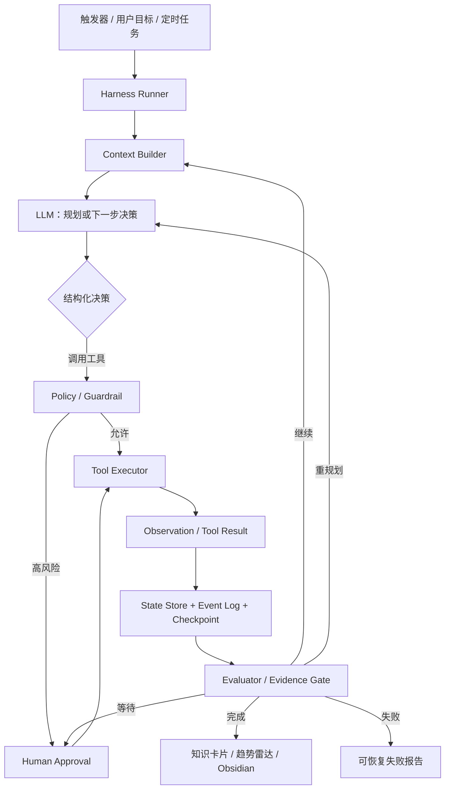

# AI Intelligence Radar：Agent Harness 架构构思 v0.1

> [!IMPORTANT]
> **优先级调整：先建立 AI 产品评估基线，再实现 Agent Harness。** 如果没有真实任务、期望行为、评分标准和一票否决规则，就无法判断 Agent 化是否带来提升。入门方案见 [AI 产品评估与 Agent 评测指南](ai-product-evaluation-guide.md)。

## 一句话定位

把 AI Intelligence Radar 升级为一个**可观察、可恢复、可评测的 AI 行业情报 Loop Agent**，并把它同时建设成一套用于学习 Agent 编排、记忆、工具、状态与评测的架构实验室。

英文副标题建议：

> An observable and durable loop-agent harness for AI industry intelligence.

## 1. 为什么适合用这个项目学习 Agent

当前项目已经具备 Agent 所需的真实环境基础：

- 有明确目标：持续发现 Codex、Claude、Gemini 等产品和公司的重要变化；
- 有工具入口：官方发布、GitHub、X、Reddit、网页采集；
- 有结构化状态：来源注册表、Intelligence Signal Schema；
- 有长期记忆：Obsidian 情报卡片与趋势雷达；
- 有可验证结果：来源链接、去重率、证据等级、知识卡片和趋势判断。

当前实现仍是确定性管道：

```text
读取输入 → 校验 → 去重 → 生成卡片 → 生成趋势报告
```

升级后的 Agent 应能够动态决定：

- 这次任务需要查哪些来源；
- 当前证据是否足够；
- 是否存在冲突、重复或信息缺口；
- 是否继续搜索、调整计划或停止；
- 哪些内容值得进入长期记忆；
- 哪些动作需要人工确认。

## 2. Agent、Framework 与 Harness 的区别

### Agent

一个最小 Agent 可以表达为：

```text
Agent = Model + Instructions + Tools + State + Loop + Stop Conditions
```

### Agent Framework

Framework 是帮助开发者实现 Agent 的代码库，例如 OpenAI Agents SDK、LangGraph、AutoGen。它提供抽象和组件，但不等于完整产品架构。

### Agent Harness

Harness 是包裹模型、让 Agent 能长期可靠工作的运行系统。它负责：

- 构造每一轮上下文；
- 调用模型并解析结构化决策；
- 注册、筛选和执行工具；
- 保存状态与检查点；
- 控制权限、预算、重试和停止；
- 管理短期与长期记忆；
- 记录 Trace、评测结果和失败原因；
- 在需要时暂停并等待人工批准。

可以把模型理解为“大脑”，把 Harness 理解为 Agent 的“操作系统与安全外壳”。

## 3. 推荐的核心架构：受控的混合 Loop

不建议把所有流程都交给模型。推荐采用：

> **外层确定性状态机 + 内层模型决策循环。**

外层代码负责安全、预算、状态、检查点和停止条件；模型只在允许范围内决定如何规划、选择工具和补充证据。



## 4. Radar Agent 的领域循环

一次典型任务：

> 查找最近 48 小时 Codex、Claude、Gemini 与 Agent Harness 的重要变化，形成 3–7 张可追溯情报卡片，并判断是否出现新趋势。

执行循环：

1. **Goal**：读取任务目标、关注主题、时效、预算和输出要求。
2. **Plan**：选择来源、拆分调查问题、确定证据标准。
3. **Act**：调用官方 Feed、GitHub、网页、X 或 Reddit 工具。
4. **Observe**：接收内容、错误、耗时、来源等级和工具元数据。
5. **Update State**：保存新信号、证据缺口、失败记录和预算消耗。
6. **Evaluate**：检查新颖性、可信度、冲突、重复与趋势门槛。
7. **Replan or Stop**：继续搜索、换来源、等待人工确认或结束。
8. **Commit Memory**：写入 Obsidian 卡片、趋势报告和本次 Run Trace。

伪代码：

```python
state = create_run(goal, budgets, policies)

while not state.is_terminal():
    context = context_builder.build(state)
    decision = model.decide(context, available_tools)
    decision = policy.validate(decision, state)

    if decision.requires_approval:
        checkpoint(state, status="waiting_approval")
        return

    observation = tool_executor.execute(decision)
    state.apply(observation)
    checkpoint(state)

    verdict = evaluator.evaluate(state)
    state.transition(verdict)

return output_builder.build(state)
```

这个 Loop 必须有边界，不能无限运行。停止条件至少包括：

- 已达到明确成功标准；
- 连续多轮没有获得新证据；
- 达到最大轮数、Token、费用或时间预算；
- 工具连续失败；
- 需要授权、登录或人工判断；
- Guardrail 拒绝继续执行。

## 5. 核心模块

| 模块 | 负责什么 | 通过本项目学习什么 |
| --- | --- | --- |
| `Runner / Orchestrator` | 驱动循环、状态迁移、重试与停止 | 任务编排、控制流 |
| `Planner` | 生成与调整调查计划 | 模型决策与代码编排边界 |
| `Context Builder` | 每轮选择需要给模型的信息 | Context Engineering |
| `Tool Registry` | 工具 Schema、权限、超时、并发与错误 | Tool Calling 与 ACI 设计 |
| `State Store` | 保存 Run 状态、步骤、预算、结果 | 状态机与持久化 |
| `Checkpoint` | 暂停、恢复、重放、分叉 | Durable Execution |
| `Memory Manager` | 工作、情节、语义和程序记忆 | 记忆生命周期 |
| `Policy / Guardrail` | 来源等级、授权、写入权限和风险控制 | Agent 安全边界 |
| `Evaluator / Critic` | 判断证据是否充分、输出是否合格 | Eval 与自我修正 |
| `Trace / Observability` | 记录模型轮次、工具调用、状态变化 | 调试、成本和质量分析 |

## 6. 四层记忆设计

### 6.1 Working Memory：本次运行记忆

保存当前目标、计划、观察、失败、候选信号和剩余预算。它只服务当前 Run，不应无限增长。

### 6.2 Episodic Memory：情节记忆

保存过去每次 Run 的事件流、工具调用、决策结果和失败恢复过程，用于调试、复盘和相似任务参考。

推荐：SQLite/PostgreSQL 状态表 + JSONL 事件日志。

### 6.3 Semantic Memory：语义记忆

保存已经确认的情报卡片、主题关系、公司演化和趋势结论。

本项目继续使用 Obsidian 作为可阅读的长期知识库；以后可增加全文检索或向量索引，但不把向量数据库误当成全部记忆。

### 6.4 Procedural Memory：程序记忆

保存 Agent 的长期规则、来源政策、Tool 说明、Skills、评测规则和运行手册。例如：

- T1/T2/T3 证据规则；
- X 与 Reddit 的平台边界；
- 什么时候必须回到官方来源；
- 什么情况下允许写入长期知识库。

## 7. 状态模型

建议核心状态至少包含：

```text
run_id
goal
status
current_step
plan
messages
observations
candidate_signals
evidence_gaps
tool_failures
budgets
approval_requests
checkpoints
final_output
```

状态迁移：

```text
CREATED
  → PLANNING
  → ACTING
  → OBSERVING
  → EVALUATING
      ├→ ACTING
      ├→ REPLANNING
      ├→ WAITING_APPROVAL
      ├→ COMPLETED
      └→ FAILED
```

核心原则：对话消息只是状态的一部分，不能把整个 Agent 状态等同于聊天记录。

## 8. 哪些部分应该 Agent 化

| 工作 | 推荐方式 | 原因 |
| --- | --- | --- |
| Schema 校验、日期过滤、URL 去重 | 确定性代码 | 规则清晰、可测试，不需要模型猜测 |
| 选择下一批来源 | Agent 决策 | 取决于当前证据缺口 |
| 判断是否需要继续搜索 | Agent + 预算规则 | 需要语义判断，同时必须受控 |
| 来源等级与平台权限 | 确定性 Policy | 不能交给模型自由解释 |
| 重要性与影响分析 | Agent + Evaluator | 需要推理，但必须保留证据 |
| 趋势是否正式成立 | 规则门槛 + Agent 解释 | 计数由代码完成，意义由模型解释 |
| 写入 Obsidian | 确定性工具 | 输出路径和格式必须稳定 |
| GitHub 发布、外部写操作 | Human-in-the-loop | 防止 Agent 自动扩大影响范围 |

真正值得学习的不是“全部 Agent 化”，而是设计清楚模型决策与确定性代码的边界。

## 9. 框架学习与选型

| 方案 | 优点 | 缺点 | 最适合的学习与使用场景 |
| --- | --- | --- | --- |
| 自研最小 Loop | 原理透明、可完全控制状态和工具 | 持久化、并发、Tracing 需要自己实现 | 第一阶段必须做，用于真正理解 Harness |
| OpenAI Agents SDK | 内置 Agent Loop、Tools、Handoffs、Guardrails、Sessions、Tracing | 状态图表达不如 LangGraph直观；对 OpenAI 生态更友好 | 学习标准 Tool Loop、Manager、Handoff 与 Trace |
| LangGraph | 显式状态图、Checkpoint、暂停恢复、HITL 和 Durable Execution 强 | 学习曲线和工程样板较多 | 长运行、有审批、有恢复要求的生产 Agent |
| AutoGen | 多 Agent 对话、团队和事件驱动模型丰富 | 容易出现对话膨胀、成本和终止控制问题 | 研究多 Agent 协作，不适合作为第一版核心 |
| Dify | 可视化、调度、插件、演示和运营方便 | 低层运行细节被隐藏，不利于单独掌握 Harness 原理 | 保留为可视化控制台和 Agent Strategy 对照实现 |

推荐学习顺序：

1. 先手写一个 200–400 行的最小 Loop Harness；
2. 用 OpenAI Agents SDK 复刻同一任务；
3. 用 LangGraph 复刻并增加 Checkpoint、暂停恢复；
4. 将 Dify 作为可视化编排与插件层进行对照；
5. 单 Agent 稳定后，再增加 Verifier、Researcher 等子 Agent；
6. 用同一组任务与指标比较效果、成本、延迟和可调试性。

参考官方资料：

- [OpenAI Agents SDK：Agent Loop](https://openai.github.io/openai-agents-python/running_agents/)
- [OpenAI Agents SDK：Agent Orchestration](https://openai.github.io/openai-agents-python/multi_agent/)
- [LangGraph：Persistence](https://docs.langchain.com/oss/python/langgraph/persistence)
- [LangGraph：Overview](https://docs.langchain.com/oss/python/langgraph/overview)
- [Deep Agents：Agent Harness](https://docs.langchain.com/oss/python/deepagents/overview)
- [Microsoft AutoGen](https://microsoft.github.io/autogen/stable/index.html)
- [Anthropic：Building Effective Agents](https://www.anthropic.com/engineering/building-effective-agents)
- [Dify：Plugin Type 与 Agent Strategy](https://docs.dify.ai/en/develop-plugin/getting-started/choose-plugin-type)

## 10. 三视角构思

### 产品经理视角

1. **学习阶梯**：每个版本只增加一个架构概念，并设清晰验收目标。
2. **双重成果**：每次开发既产生真实情报，也产出一篇 Agent 架构复盘。
3. **架构对照实验**：同一任务跨框架执行并比较质量、成本、延迟和可恢复性。
4. **公开案例库**：把成功、失败和恢复案例沉淀为 GitHub 可展示内容。
5. **能力地图**：用任务编排、记忆、工具、状态、评测五个维度展示掌握程度。

### 产品设计视角

1. **Run Timeline**：按时间展示每轮 Plan、Tool、Observation、State 和 Verdict。
2. **State Inspector**：可查看任意检查点的状态快照与前后差异。
3. **Memory Explorer**：区分工作、情节、语义和程序记忆，展示写入原因。
4. **Tool Call Card**：显示参数、权限、耗时、结果摘要、失败与重试。
5. **Replay Lab**：从历史检查点重新运行，并比较新旧轨迹。

### 软件工程师视角

1. **Minimal Harness**：手写核心循环、状态和工具协议。
2. **Typed Tool Contract**：使用严格输入输出 Schema、超时、幂等和错误分类。
3. **Checkpoint/Resume**：每个有效步骤都可持久化和恢复。
4. **Eval Harness**：固定任务集、规则评分、LLM Judge 和回归测试结合。
5. **Framework Adapters**：同一领域工具适配 OpenAI SDK、LangGraph、Dify。

## 11. 优先方案（含 P0 前置）

### P0. Eval Contract 与当前版本基线

一句话：先冻结 12 个真实 Eval Case、0–2 分 Rubric 和一票否决项，再评估当前确定性管道。

选择原因：只有先明确“什么叫做好”，后续才有依据比较自研 Loop、模型、Prompt、Tool 和框架。

关键假设：第一版人工评分与自动规则结合即可，不需要先建设复杂评测平台。

### P1. 自研 Minimal Loop Harness

一句话：先不依赖完整 Agent 框架，亲手实现 Plan → Act → Observe → Evaluate → Stop。

选择原因：这是掌握 Agent 原理的最短路径，能够看清每个框架替你做了什么。

关键假设：核心 Loop 可以控制在 200–400 行，并由现有工具和测试支撑。

### P2. 可观察 Run Timeline

一句话：每次运行都生成结构化事件日志和一份人类可读的执行报告。

选择原因：没有 Trace 就无法理解 Agent 为什么成功、失败或浪费成本。

关键假设：JSONL Event Log 已足够支撑第一版调试，不需要先建复杂前端。

### P3. 四层记忆系统

一句话：明确区分本次状态、历史运行、长期知识和运行规则。

选择原因：记忆管理是用户的核心学习目标，也能直接复用现有 Obsidian 能力。

关键假设：SQLite/JSONL + Obsidian 可以满足第一阶段，不必立即引入向量数据库。

### P4. Eval 与 Replay Lab

一句话：固定一组情报任务，可从检查点重放并比较不同模型、Prompt 和框架。

选择原因：Agent 是多轮系统，只有输出测试不够，必须评估过程、工具和状态。

关键假设：可以定义来源覆盖、事实性、重复率、工具成功率、成本和步骤数等客观指标。

### P5. Framework Comparison Adapters

一句话：领域工具保持不变，只替换 Runner，实现自研 Loop、OpenAI SDK 和 LangGraph 对照。

选择原因：帮助形成“架构能力”而不是“框架 API 记忆”。

关键假设：工具与领域逻辑能通过稳定协议从框架运行时解耦。

## 12. 推荐 MVP：v0.3 Agent Core

第一版只做一个 Agent，不急着多 Agent。

### Agent

- `RadarAgent`：拥有最终目标和最终输出控制权。

### 首批工具

- `list_sources`：读取来源注册表；
- `fetch_source`：获取单个官方来源；
- `search_memory`：查询既有情报卡片；
- `normalize_signal`：生成严格 Signal Schema；
- `check_duplicates`：执行确定性事件去重；
- `save_checkpoint`：保存状态；
- `write_knowledge_card`：写入 Obsidian；
- `write_trend_report`：生成趋势报告。

### 第一版不做

- 不先做多个 Agent 自由群聊；
- 不让模型自行修改权限与来源等级；
- 不在没有 Token 时绕过 X、Reddit 平台限制；
- 不把所有历史对话直接塞进 Prompt；
- 不让 Agent 自动发布 GitHub、发送消息或执行高影响外部写操作。

### MVP 验收标准

1. 输入一个情报目标，Agent 能完成至少两轮工具调用并主动停止；
2. 每轮都有结构化 Decision、Observation、State 和 Trace；
3. 中断进程后可以从最近检查点恢复；
4. 所有长期知识都保留来源、时间和证据等级；
5. 连续无新证据、超预算或工具失败时能够正确终止；
6. 相同输入可进入自动评测，并比较不同 Runner；
7. 单元测试不只测最终文本，还覆盖状态迁移、工具错误和停止条件。

## 13. 建议代码结构

```text
ai-intelligence-radar/
├── agent/
│   ├── runner.py              # 核心 Loop
│   ├── state.py               # RunState 与状态迁移
│   ├── context.py             # 上下文构造与压缩
│   ├── planner.py             # 计划与重规划
│   ├── policy.py              # 权限、预算、来源规则
│   └── evaluator.py           # 证据门与停止判断
├── agents/
│   └── radar_agent.py         # 领域 Agent 配置
├── tools/
│   ├── registry.py            # Tool Schema 与注册
│   ├── source_tools.py
│   ├── memory_tools.py
│   └── output_tools.py
├── memory/
│   ├── checkpoint.py
│   ├── episodic.py
│   └── semantic.py
├── runtime/
│   ├── scheduler.py
│   └── event_log.py
├── adapters/
│   ├── custom_loop.py
│   ├── openai_agents.py
│   ├── langgraph.py
│   └── dify.py
├── evals/
│   ├── tasks/
│   ├── graders/
│   └── benchmark.py
└── tests/
    ├── test_state_machine.py
    ├── test_tools.py
    ├── test_resume.py
    └── test_agent_eval.py
```

## 14. 分阶段学习路线

### 阶段 A：看清 Agent Loop

实现自研 Runner、Tool Contract、RunState、停止条件和 JSONL Trace。

### 阶段 B：掌握状态与记忆

增加 Checkpoint/Resume、四层记忆、Context Builder 和 Obsidian 写入。

### 阶段 C：掌握可靠性

增加 Tool Guardrail、Human-in-the-loop、预算、重试、幂等、Replay 和 Eval。

### 阶段 D：理解框架差异

用 OpenAI Agents SDK、LangGraph 和 Dify 分别实现相同任务，输出对照报告。

### 阶段 E：进入多 Agent

只在单 Agent 基线稳定后增加：

- `ResearchAgent`：深度调查某个主题；
- `VerifierAgent`：独立核验证据与冲突；
- `SynthesizerAgent`：形成跨公司趋势；
- `RadarAgent`：作为 Manager，控制最终判断和共同 Guardrail。

这个场景更适合 Manager 调用专业 Agent，而不是让 Handoff 后的专业 Agent 直接接管最终输出。

## 15. 最重要的设计原则

1. **先单 Agent，后多 Agent。**
2. **先定义状态和停止条件，再写 Prompt。**
3. **确定性任务留在代码里，语义不确定性才交给模型。**
4. **Tool 接口质量通常比增加 Agent 数量更重要。**
5. **Memory 是有生命周期的数据，不是无限追加聊天记录。**
6. **每个有副作用的动作都必须有权限与审批策略。**
7. **没有 Trace 和 Eval 的 Agent 不具备可维护性。**
8. **同一真实任务跨框架对照，才能形成架构判断力。**

## 16. 下一步建议

下一步先把 v0.3 收窄为一套评估基线、一张工程设计图和一个最小可运行 Loop：

1. 建立 12 个真实 Eval Case、评分 Rubric 和一票否决项；
2. 评估当前确定性管道，形成 baseline；
3. 冻结 `RunState`；
4. 冻结 Tool Contract；
5. 定义 6 类终止条件；
6. 设计 JSONL Event Schema；
7. 用现有示例数据完成无模型的 FakeModel Loop 测试；
8. 再接入真实模型，避免一开始把评估、状态机和模型问题混在一起。
